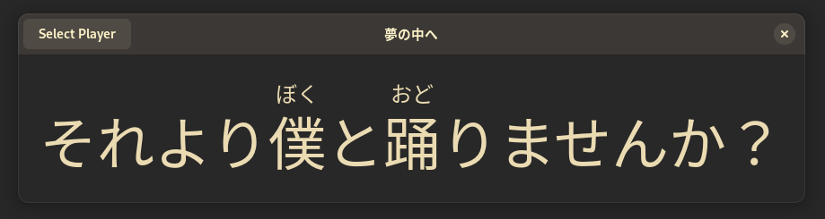

# phonoscope


A rather simple application that displays locally-sourced, MPRIS-synchronised lyrics (with ruby characters).

## Prerequisites
A Rust toolchain, or a friend with a Rust toolchain.

```
$ cargo run
```

## Lyrics
Phonoscope sources lyrics from a folder in its current working directory labelled `lyrics`. Each file must have an extension of `.lrc`.

The file format that Phonoscope uses is similar to LRC, with only two differences:
- There must be one whitespace character in between the timestamp and line text.
- Characters with ruby readings must be whitespace-separated from the rest of the line and split in half with either `|` or `｜`. Characters to the left are treated as normal during rendering, while characters to the right will act as a reading aid and be rendered on top.
